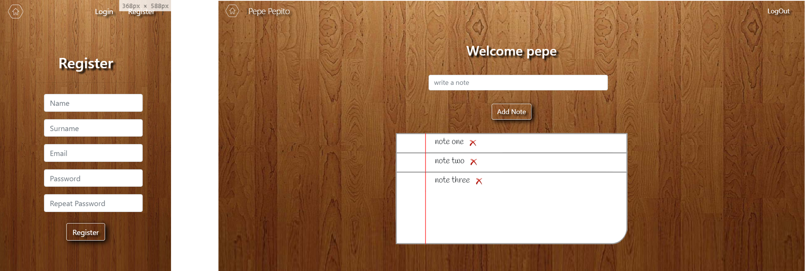

# Add note: Aggregator of notes with user registration

          
  
## Target
This app allows you to register users and add and delete notes

  
 ## Functional description
In the frontend of the app, basic technologies such as html5 css and bootstrap have been used in addition to react and redux as store.
As for the backend, node has been used for the server, mongo / mongose for the database and mocha / chai for the testing.
  
 ## Screenshots

 
 
 

  
## Technical Steps to Start App in Local

### 1º- Server side: 

Install dependencies and modules from package.json. Use command “npm install” on each of the folders:
   -server/data
   -server/logic
   -server/api

START SERVER on localhost from server/api. Command: nodemon .

### 2º- Client side:

Install dependencies and modules from package.json. Use command “npm install” on each of the folders:
   -client/api
   -client/app (React)

START REACT APP on browser from client/app. Command: npm start
  